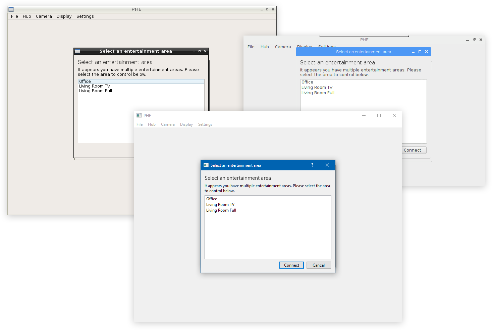

# PiHueEntertainment

An application that can utilise a webcam plugged into a Raspberry Pi (or Windows desktop) to output to Philips Hue Entertainment Areas.

## What does this mean?
This allows you to point a compatible camera at any screen or display and synchronise your Hue lights with it, regardless of where the content on the display is coming from. This means you no longer have to route content through a desktop running Hue Sync to have a dynamic room.

## Current capabilities
* A full UI to connect to a Hue Hub, select an entertainment area and view the camera input.
* Works on Windows desktops, Raspberry Pi (3B or B+ is recommended) and ASUS Tinker Board but is probably capable of many more platforms with some tweaking.

## Limitations
* Due to the limited power of the Raspberry Pi, it is only really capable of capturing at about 10fps, which is mostly fine for lighting.
* Camera latency could be an issue. I've only been using an old dashcam as a camera though, so this could just be down to the camera performance.

## Setting up
* Connect a compatible camera to your device.
* Download the current release version (for Windows x64 or Debian (ARM)), or compile your own using the available code.
  * Compilation requires Qt 5.7 and the Hue Entertainment API.
* For Windows (x64)
  * Extract the Windows_x64 folder in the zip file if you have downloaded the release file.
  * Run the executable. This will require the [2017 C++ Redistributables](https://aka.ms/vs/15/release/vc_redist.x64.exe).
* For Linux (ARM)
  * Extract the Debian_ARM folder if you have downloaded the release file.
  * Download the Qt 5.7.1 packages (qtbase and qt5multimedia)
  * Ensure the correct execute permissions are set for the .out file and execute the file.
* Start the application up, and you should be greeted with a window asking you to connect to your Hue Bridge. To do this, press the button on the middle of the Hue bridge you wish to connect to. (This can be changed later)
* If you have more than one entertainment area you will be asked to choose the area you wish to control. Entertainment areas need to be set up using the Hue app.
* You should now see output from your connected camera. If you only see a blank screen, your camera is incompatible or not correctly connected. You can change orientation settings by selecting the *Display* item on the toolbar and changing the available settings. More options will become available as the development progresses.

## Keep in mind this is an Alpha version
This application will have bugs and some things might not work right, but this will become more stable in the future. Please report all bugs, issues and feature requests you may have on here and I will see what I can do, however I don't have much time to devote to a project like this so things might happen slowly.
